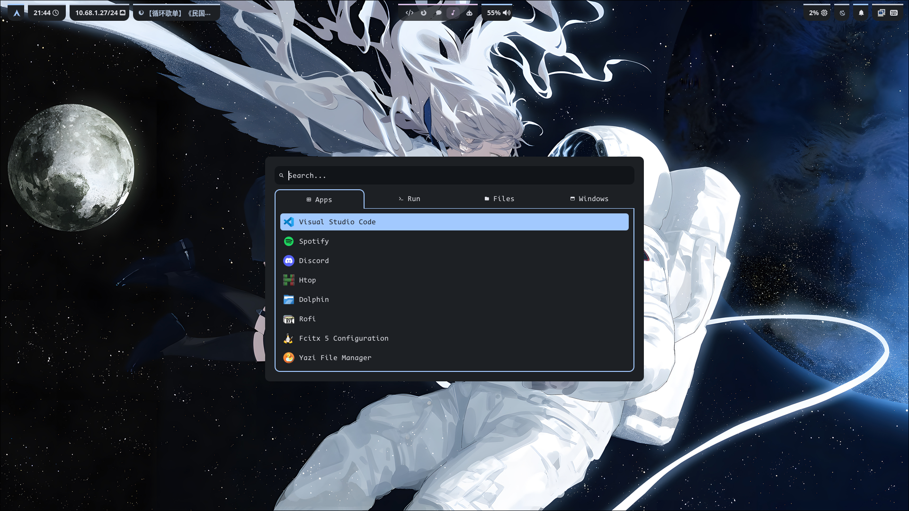
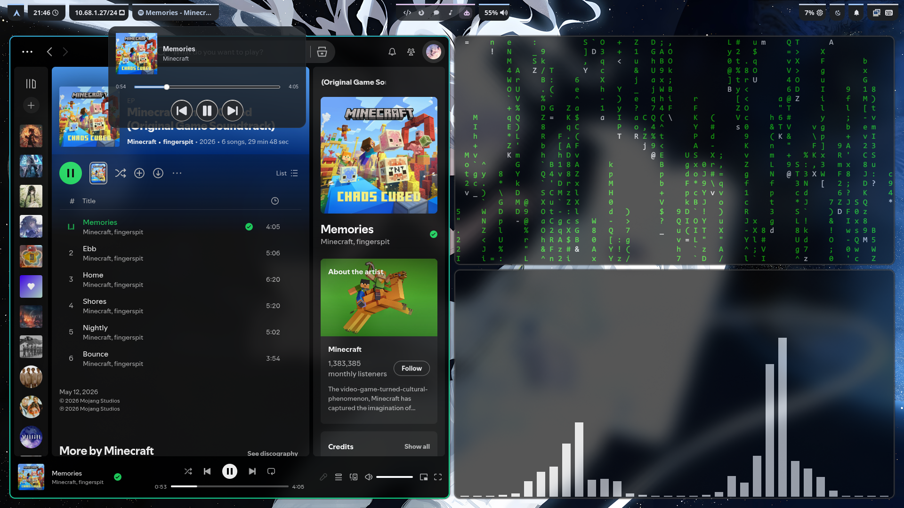

<h1 align="center">☄ astroprism ☄</h1>

<p align="center">
  Light in, spectrum out — Arch Linux + Hyprland dotfiles that refract a wallpaper into an entire desktop.
</p>

<p align="center">
  
  
  
</p>

<p align="center">
  
  
</p>

##  Features

- **Wallpaper-driven theming** — `wallset` opens a rofi picker with previews; one click re-colors Hyprland borders, Waybar, Kitty, Rofi, swaync, btop, starship and GTK apps via [matugen](https://github.com/InioX/matugen) (Material You)
- **Light / dark toggle** — a Waybar module regenerates the whole scheme in the other mode, same wallpaper
- **Custom MPRIS popup** — click the Waybar media module for a popup with cover art and playback controls, written in Rust
- **Workspace overview** — `Super+Tab` or a Waybar button drops a fullscreen overlay with every workspace as a card of live window thumbnails; hover and click, or arrow-keys and Enter, to jump
- **Screenshot applet with scroll capture** — a rofi menu (`Super+P`) for desktop/window/area/timed shots, plus **scroll capture** (record while you scroll, frames get stitched into one tall PNG by a small Go tool) and **screen recording**
- **Reproducible installs** — exported pacman/AUR package lists + deploy/sync scripts make reinstalling (or borrowing) the setup a few commands; `deploy.sh` compiles the Rust/Go helpers for you and skips the ones whose sources haven't changed

## What's inside

| Part | Choice |
|---|---|
| WM | [Hyprland](https://hypr.land/) — configured in **Lua** (`hyprland.lua`) |
| Bar | Waybar, with custom MPRIS popup, light/dark toggle & ext/workspaces |
| Workspace overview | [hyprexpose](https://github.com/ThiagoAVicente/hyprexpose) — `Super+Tab` or a Waybar button |
| Launcher / menus | Rofi (launcher, applets, wallpaper picker) |
| Terminal | Kitty |
| Editor | Neovim (LazyVim & Neovide) |
| Shell | zsh + starship (bash config kept as fallback) |
| Notifications | swaync |
| Lockscreen | hyprlock |
| Wallpaper | awww + `wallset` script |
| Theming | [matugen](https://github.com/InioX/matugen) — Material You colors from wallpaper |
| Display manager | SDDM (`sddm-astronaut-theme`) |
| Input method | fcitx5 + chewing |

## Repo layout

```
config/      → ~/.config/…        (hypr, kitty, nvim, waybar, matugen, rofi, uwsm, wallpapers)
local/bin/   → ~/.local/bin/…     (wallset, wallset-backend, gpu-mode, prime-run)
bashrc/zshrc → ~/.bashrc, ~/.zshrc
Packages/    → exported package lists (pacman / AUR / failed log)
Scripts/     → deploy.sh, sync.sh, pkg.sh
Docs/        → screenshots + manual-setup.md (the /etc bits deploy.sh can't write)
```

Everything matugen writes (`hypr/colors/`, `waybar/colors.css`, `kitty/colors/`, `rofi/colors/`,
`~/.config/starship.toml`, `~/.config/hyprexpose/config.toml`) is generated, not tracked — the
templates in `config/matugen/templates/` are the source of truth. `deploy.sh` keeps those generated
files in place when it redeploys a config directory.

## Installation

> [!WARNING]
> These are personal dotfiles, not a distro. `deploy.sh` **overwrites** existing configs (they're backed up as `*.backup` first), and the package lists include desktop apps like Discord, Spotify and VS Code. Read the scripts and trim `Packages/*.txt` before running anything.

```sh
# 0. install base system and yay first
sudo pacman -S --needed base-devel git
git clone https://aur.archlinux.org/yay.git /tmp/yay && (cd /tmp/yay && makepkg -si)

# 1. clone this dotfile
git clone git@github.com:JialaChang/astroprism.git
cd astroprism

# 2. install everything from the exported lists
./Scripts/pkg.sh install        # failures are logged to Packages/pkg-failed.txt

# 3. deploy configs (builds the Rust/Go helpers first, needs cargo + go)
./Scripts/deploy.sh backup      # saves existing configs as *.backup
./Scripts/deploy.sh deploy      # build + copy configs into place + hyprctl reload

# 4. set a wallpaper — this also generates the whole color scheme
wallset
```

## Scripts

| Script | What it does |
|---|---|
| `deploy.sh backup` | Backs up every target as `*.backup` before overwriting |
| `deploy.sh build` | Compiles `mpris-popup` (cargo) and `scrollstitch` (go); each target is stamped with a hash of its sources + build command, so an unchanged tree skips the compiler |
| `deploy.sh deploy` | `build`, then repo → system: copies all configs into `~/.config`, `~/.local/bin`, dotfiles into `~`, then `hyprctl reload` |
| `sync.sh` | System → repo: pulls current configs back in and re-exports package lists (run before committing) |
| `pkg.sh export` | Writes explicitly-installed packages to `Packages/pkg-pacman.txt` / `pkg-aur.txt` (debug pkgs excluded) |
| `pkg.sh install` | `pacman -Syu`, then installs both lists; failures go to `Packages/pkg-failed.txt` |

> Both `deploy.sh` and `sync.sh` do `rm -rf` + copy on whole directories — they *replace*, not merge.  
> The one exception is matugen's generated color files, which `deploy.sh` stashes and puts back.  
> Build stamps live in `.deploy-stamps/`; delete it to force a rebuild.

## Dynamic theming

The whole desktop is re-colored from the current wallpaper:

```
wallset (rofi picker with previews)
  └─ wallset-backend <image>
       ├─ awww img …                  # animated wallpaper switch
       ├─ matugen image …             # generate colors from the image
       │    └─ templates → hyprland, kitty, rofi, waybar, swaync, btop, starship, GTK 3/4, hyprexpose
       ├─ restart waybar, reload swaync
       └─ remembers wallpaper in ~/.cache/last_wallpaper
```

- Templates live in `config/matugen/templates/`, targets are wired up in `config/matugen/config.toml`.
- `waybar/scripts/theme-toggle.sh` re-runs matugen in light/dark mode on the last wallpaper; state is kept in `~/.cache/theme_mode`.

## Waybar MPRIS popup

Click the mpris module → a popup with cover art and playback controls.

- Active version: **Rust** (`config/waybar/scripts/mpris-popup/`), built by `deploy.sh` (waybar's `on-click` points at `target/release/mpris-popup`).

The workspaces module is `ext/workspaces` (the ext-workspace-v1 protocol), not `hyprland/workspaces`:
the latter clicks send Hyprland's legacy `dispatch workspace N` string, which the Lua config provider
rejects as a syntax error. Since that module has no `persistent-workspaces` option, workspaces 1–5 are
kept alive by persistent `workspace_rule`s in `hyprland.lua`.

## Screenshot applet

`Super+F` opens the rofi screenshot menu; `Ctrl+Shift+F` goes straight to an area shot. Shots are saved to `~/Pictures/Screenshot` and copied to the clipboard.

- Desktop / window / area / timed shots via grim + slurp.
- **Scroll capture** — start recording a region, scroll through the content, open the menu again to stop; the recording is piped through ffmpeg as raw RGBA straight into `scrollstitch`, a small Go tool in `config/rofi/applets/bin/scrollstitch/` that overlaps the frames into one tall PNG. Built by `deploy.sh` (falls back to building on first use, needs `go`).
- **Screen recording** — toggle a region recording, saved to `~/Videos/Screenrecord`.

`scrollstitch` reports per frame on stderr which ones it placed, skipped as duplicates, or couldn't
match — visible when the applet is run from a terminal (`screenshot --opt5` alias), dropped on a keybind
launch. Its matcher is covered by `stitch_test.go` (`go test ./...` in the tool's directory).

## Credits

- Parts of this setup adapted from [Noro18/linux-ricing-dotfiles](https://github.com/Noro18/linux-ricing-dotfiles)
- Rofi launchers & applets based on [adi1090x/rofi](https://github.com/adi1090x/rofi)
- [matugen](https://github.com/InioX/matugen) for Material You color generation
- [hyprexpose](https://github.com/ThiagoAVicente/hyprexpose) for the workspace overview
- [LazyVim](https://www.lazyvim.org/) as the Neovim base
- [sddm-astronaut-theme](https://github.com/Keyitdev/sddm-astronaut-theme)
