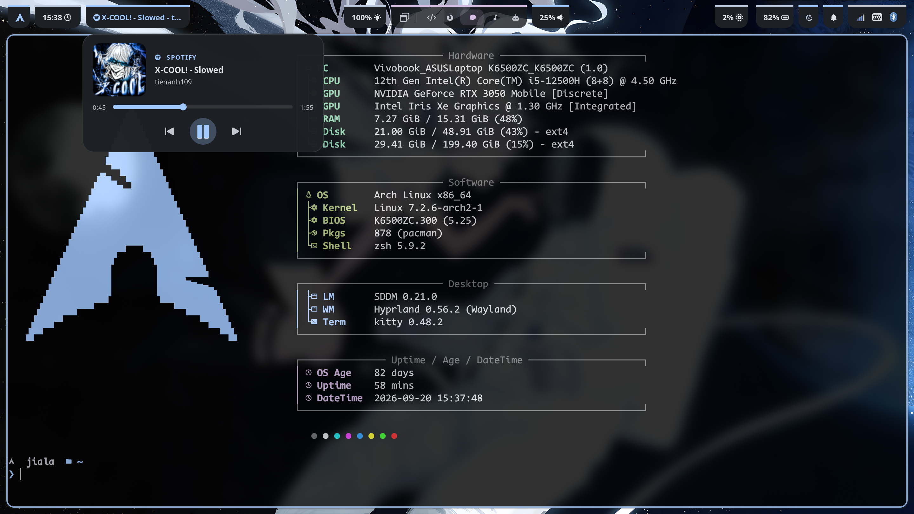
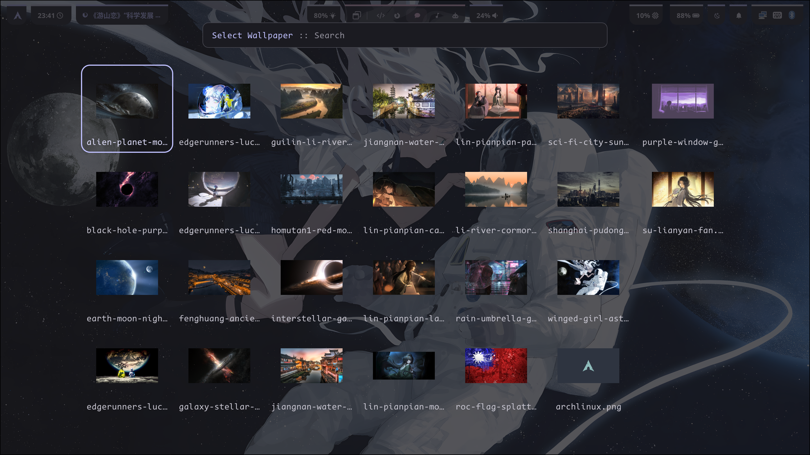
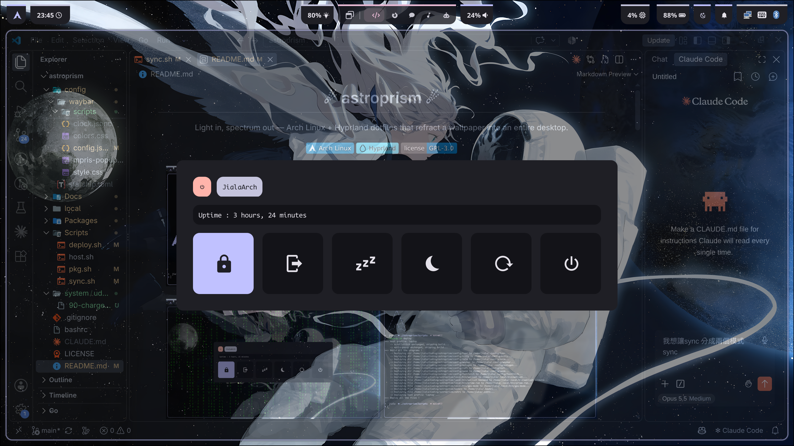
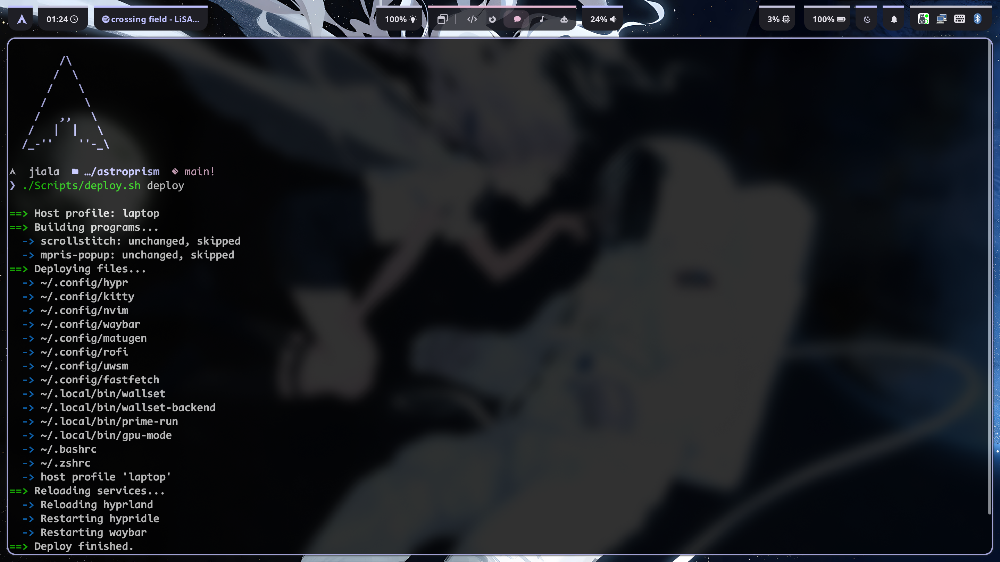

<h1 align="center">☄ astroprism ☄</h1>

<p align="center">
  Light in, spectrum out — Arch Linux + Hyprland dotfiles that refract a wallpaper into an entire desktop.
</p>

<p align="center">
  
  
  
</p>

<p align="center">
  
  
</p>

<p align="center">
  
  
</p>

##  Features

- **Wallpaper-driven theming** — pick a wallpaper, the whole desktop recolors itself via [matugen](https://github.com/InioX/matugen) (Material You), light or dark
- **Custom MPRIS popup** — cover art and playback controls, one click from the bar
- **Workspace overview** — a fullscreen grid of live window thumbnails
- **Screenshot applet** — desktop/window/area/timed shots, screen recording, and scroll capture that stitches a scrolling page into one tall PNG
- **Themed lock screen** — hyprlock recolored from the wallpaper, with hypridle handling the idle dim/lock/blank/suspend schedule
- **Battery charge limit** (laptop) — click the bar's battery to cap charging at 80%, reapplied on boot and after every resume
- **Reproducible installs** — exported package lists and deploy/sync scripts get the setup back in a few commands, on either machine

## What's inside

| Part | Choice |
|---|---|
| WM | [Hyprland](https://hypr.land/) — configured in **Lua** (`hyprland.lua`) |
| Bar | Waybar |
| Workspace overview | [hyprexpose](https://github.com/ThiagoAVicente/hyprexpose) |
| Launcher / menus | Rofi (launcher, applets, wallpaper picker) |
| Terminal | Kitty |
| Editor | Neovim (LazyVim & Neovide) |
| Shell | zsh + starship (bash config kept as fallback) |
| Notifications | swaync |
| Lockscreen | hyprlock (matugen-themed) + hypridle for idle locking |
| Wallpaper | awww + `wallset` script |
| Theming | [matugen](https://github.com/InioX/matugen) |
| Display manager | SDDM (`sddm-astronaut-theme`) |
| Input method | fcitx5 + chewing |

## Repo layout

```
config/      → ~/.config/…        (hypr, kitty, nvim, waybar, matugen, rofi, uwsm, fastfetch, wallpapers)
config/hosts/→ per-machine values (one dir per profile — see config/hosts/README.md)
local/bin/   → ~/.local/bin/…     (wallset, wallset-backend, gpu-mode, prime-run — deploy-only)
bashrc/zshrc → ~/.bashrc, ~/.zshrc
Packages/    → exported package lists, one dir per host profile
Scripts/     → deploy.sh, sync.sh, pkg.sh
system/udev/ → /etc/udev/rules.d/… (root, installed by hand — see Docs/manual-setup.md)
Docs/        → screenshots + manual-setup.md (the /etc bits deploy.sh can't write)
```

Everything matugen writes is generated, not tracked — the templates in `config/matugen/templates/`
are the source of truth, and `deploy.sh` keeps the generated files in place when it redeploys a
config directory.

## Installation

> [!WARNING]
> These are personal dotfiles, not a distro. `deploy.sh deploy` **overwrites** existing configs without backing them up — run `deploy.sh backup` first if you want a copy — and the package lists include desktop apps like Discord, Spotify and VS Code. Read the scripts and trim `Packages/<profile>/` before running anything.

```sh
# 0. install base system and yay first
sudo pacman -S --needed base-devel git
git clone https://aur.archlinux.org/yay.git /tmp/yay && (cd /tmp/yay && makepkg -si)

# 1. clone this dotfile
git clone git@github.com:JialaChang/astroprism.git
cd astroprism

# 2. deploy configs (builds the Rust/Go helpers first, needs cargo + go)
./Scripts/deploy.sh backup            # optional: saves existing configs as *.backup
./Scripts/deploy.sh deploy desktop    # profile: desktop | laptop

# 3. install everything from this profile's lists
./Scripts/pkg.sh install        # failures are logged to Packages/pkg-failed.txt

# 4. set a wallpaper — this also generates the whole color scheme
wallset
```

> [!IMPORTANT]
> Step 4 is not cosmetic. Every config that pulls in a matugen-generated file — `hyprland.lua`,
> waybar's `clock.jsonc`, `hyprlock.conf` — needs `wallset` to have run once. hyprlock will not
> start without its colors, which means the screen will not lock, so run `hyprlock` by hand after
> the first deploy and check that your password unlocks it before trusting the idle timer.

## Scripts

| Script | What it does |
|---|---|
| `deploy.sh backup` | Backs up every target as `*.backup`; run manually before `deploy` if you want a safety copy |
| `deploy.sh build` | Compiles `mpris-popup` (cargo) and `scrollstitch` (go); each target is stamped with a hash of its sources + build command, so an unchanged tree skips the compiler |
| `deploy.sh deploy [profile]` | `build`, then repo → system: copies all configs into `~/.config`, `~/.local/bin`, dotfiles into `~`, applies the host profile, then reloads Hyprland and restarts hypridle and waybar |
| `sync.sh` | System → repo: pulls `~/.config` and the shell rc files back in (needs `rsync`) and re-exports package lists (run before committing). `local/bin/` is left out on purpose — see below |
| `pkg.sh export` | Writes explicitly-installed packages to `Packages/<profile>/` (debug pkgs excluded) |
| `pkg.sh install` | `pacman -Syu`, then installs this profile's lists; failures go to `Packages/pkg-failed.txt` |

> Both scripts *replace* whole directories rather than merging — each uses `rsync --delete` (which
> also skips build output like `target/`), and single files are copied straight over.  
> Generated and per-machine files are excluded rather than overwritten, so neither direction ever
> touches them: matugen's color output, and the deployed `host.*` files that belong to
> `config/hosts/<profile>/`.  
> `local/bin/` is deploy-only: those four scripts are repo-authoritative, so `sync.sh` never pulls
> them back and a scratch edit on the machine cannot land in the repo. Edit them here, then deploy —
> a live edit to `~/.local/bin/` is overwritten by the next `deploy`.  
> Build stamps live in `.deploy-stamps/`; delete it to force a rebuild.

## Dynamic theming

The whole desktop is re-colored from the current wallpaper. `Super+M` opens the picker:

```
wallset (rofi picker with previews, then a color-strategy row)
  └─ wallset-backend <image> [--prefer strategy]
       ├─ awww img …                  # animated wallpaper switch
       ├─ matugen image … --mode … --prefer …   # generate colors from the image
       │    └─ templates → hyprland, hyprlock, kitty, rofi, waybar, swaync, btop,
       │                   starship, fastfetch, GTK 3/4, hyprexpose
       ├─ restart waybar, reload swaync
       └─ remembers wallpaper in ~/.cache/last_wallpaper
```

- Templates live in `config/matugen/templates/`, targets are wired up in `config/matugen/config.toml`.
- `waybar/scripts/theme-toggle.sh` re-runs matugen in light/dark mode on the last wallpaper.
- `~/.cache/theme_mode` and `~/.cache/theme_prefer` hold the current light/dark mode and matugen
  `--prefer` color strategy; `wallset-backend` and `theme-toggle.sh` both read and write them, so
  switching a wallpaper or toggling light/dark never overwrites the other's choice.

## Waybar MPRIS popup

Click the mpris module → a popup with cover art and playback controls. Written in Rust
(`config/waybar/scripts/mpris-popup/`, split into `art`, `mpris` and `ui` modules) and built by
`deploy.sh`, which copies the binary next to its sources so the deployed config carries no
`target/`; waybar's `on-click` points at `~/.config/waybar/scripts/mpris-popup/mpris-popup`.

State is signal-driven rather than polled: `PropertiesChanged` from playerctld plus `Seeked` for the
position MPRIS never notifies on. Bursts of those signals are coalesced into one refresh and seek
drags are debounced, because every `playerctl` call is a fork that would otherwise block the GTK main
loop. Remote cover art is fetched off-thread with a timeout and a size cap.

## Waybar workspaces

The workspaces module is `ext/workspaces` (the ext-workspace-v1 protocol), not `hyprland/workspaces`:
the latter clicks send Hyprland's legacy `dispatch workspace N` string, which the Lua config provider
rejects as a syntax error. Since that module has no `persistent-workspaces` option, workspaces 1–5 are
kept alive by persistent `workspace_rule`s in `hyprland.lua`.

## Screenshot applet

`Super+F` opens the rofi screenshot menu; `Ctrl+Shift+F` goes straight to an area shot. Shots are saved to `~/Pictures/Screenshot` and copied to the clipboard.

- Desktop / window / area / timed shots via grim + slurp.
- **Scroll capture** — start recording a region, scroll through the content, open the menu again to stop; the recording is piped through ffmpeg as raw RGBA straight into `scrollstitch`, a small Go tool in `config/rofi/applets/bin/scrollstitch/` that overlaps the frames into one tall PNG. Built by `deploy.sh` (falls back to building on first use, needs `go`).
- **Screen recording** — toggle a region recording, saved to `~/Videos/Screenrecord`.

`scrollstitch` reports per frame on stderr which ones it placed, skipped as duplicates, or couldn't
match — visible when the applet is run from a terminal (`screenshot --opt5` alias), dropped on a keybind
launch. Its matcher is covered by `stitch_test.go` (`go test ./...` in the tool's directory).

## Credits

- Parts of this setup adapted from [Noro18/linux-ricing-dotfiles](https://github.com/Noro18/linux-ricing-dotfiles)
- Rofi launchers & applets based on [adi1090x/rofi](https://github.com/adi1090x/rofi)
- [matugen](https://github.com/InioX/matugen) for Material You color generation
- [hyprexpose](https://github.com/ThiagoAVicente/hyprexpose) for the workspace overview
- [LazyVim](https://www.lazyvim.org/) as the Neovim base
- [sddm-astronaut-theme](https://github.com/Keyitdev/sddm-astronaut-theme)
